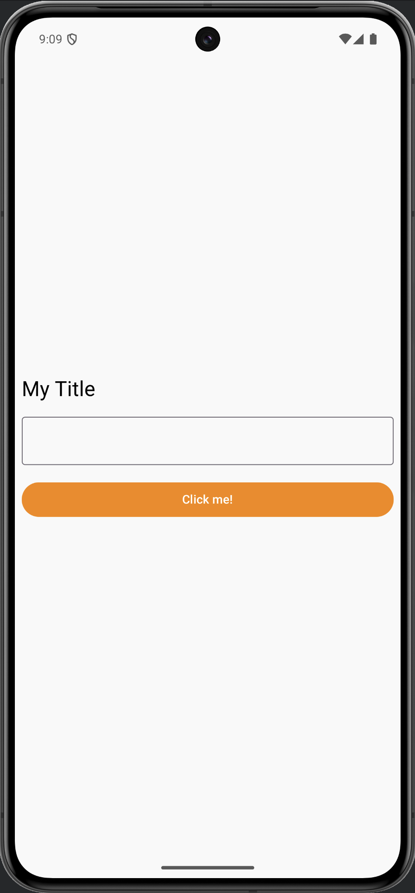

# Viikkotehtävä 4

## Material 3 Theming

In Material 3, colors are defined using
ColorScheme. Your task is to change the button's color to orange by modifying the primary
color in the ColorScheme.

## Implemented UI

